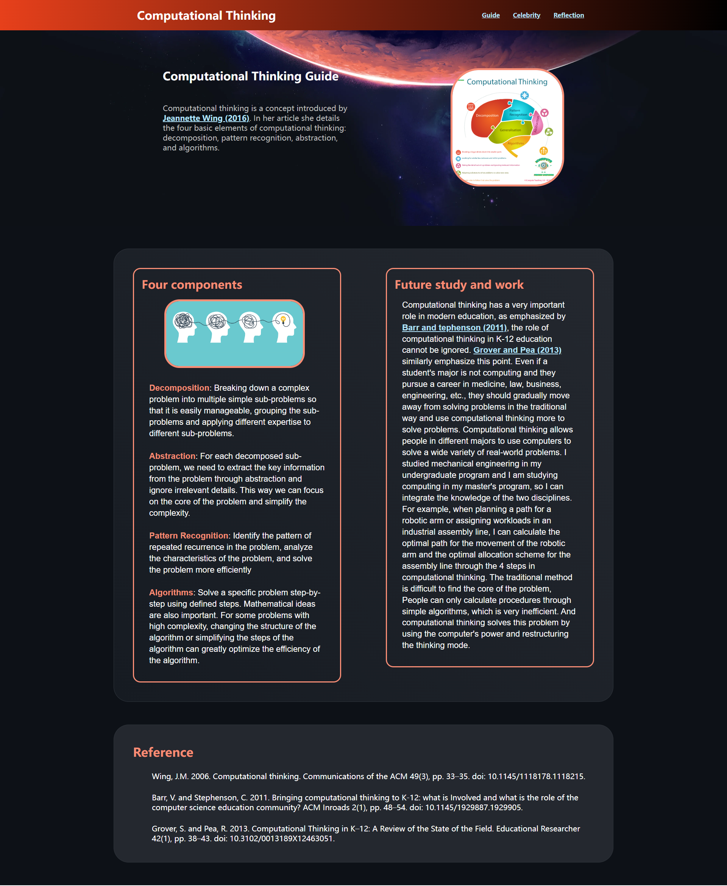
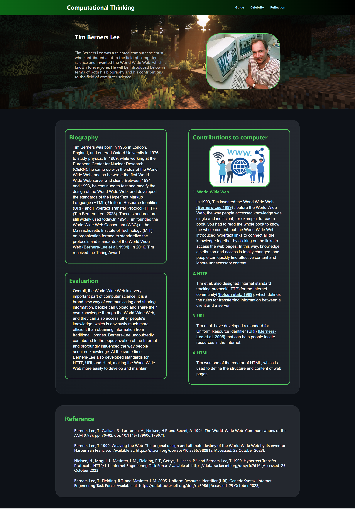
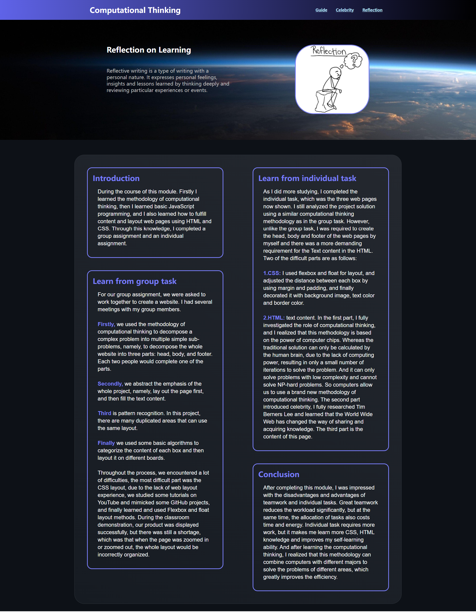

# Web-Page-Design
Three web pages were designed using basic CSS and HTML. The project layout mainly utilized float layout and flex layout.

The first page introduces the concept of computational thinking. The second page introduces Tim Berners-Lee. The last page focuses on my experiences and feelings during and after designing the web page.

